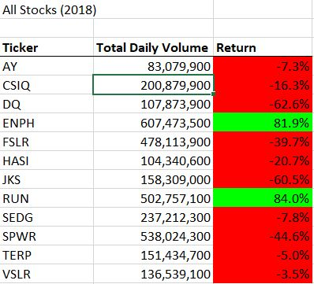
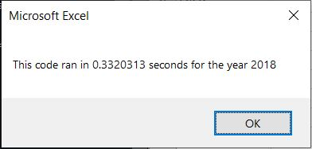

# VBA of Wallstreet

## Overview of Project 

We have been asked by our friend Steve to perform an analysis on the market trends of green companies in order to help his parents with their investments. 

To perform this analysis, we created macros in VBA that looked at the Total Daily Volume and the Rate of Return for green company stocks over the course of certain years. Initially, we looked specifically at the DQ stock, since that was what Steve's parents had invested in. However, in order to ensure we had a more complete picture of the market in green companies and to assist in diversifying Steve's parents' investments, we expanded our analysis over stocks in all green companies.

Finally, once we set up a macro that was both useful for Steve's work and could be easily understood and used by him - for example, by formatting the results and creating simple buttons that can run the analysis on a given year - we refactored our code to reduce runtime and strain on the system, ensuring more efficient results.

## Results

### Stock Performance

We found that 2017 was a good market year for green companies. Every company that was analyzed had a positive rate of return, with the exception of TERP, which lost 7.2% of value over the year. Four stocks in particular - DQ, ENPH, FSLR, and SEDG - at least doubled their value over 2017, with DQ having the largest increase in value with +199.2%. It's clear that DQ would have been a fantastic stock to invest in at the beginning of 2017. 

Unforunately, 2018 did not live up to the expectations of 2017 in green companies' market performance. The general trend for green companies during 2018 was a loss of market value. Only ENPH and RUN maintained a postive rate of return, with both increasing their value by around 82-84%. DQ lost the most value during this year with a 62.6% decrease.

Although DQ did very poorly in 2018, so did most other green company stock during this time. With its strong performance in 2017 - even relative to other positive stocks at the time - it may not be prudent for Steve's parents to divest just yet. Ultimately, however, this decision may require further analysis into DQ itself to determine whether its change in performance between 2017 and 2018 are due to it being over-hyped and valued as a company or rather due to broader market trends at the time.

Further, this initial analysis suggests that ENPH and RUN may be good investments in the long term, as they both had positive returns through both 2017 and 2018. That is, even when the general market trend for green companaies was negative, they managed to successly continue their growth.

Conversely, TERP does not appear to be a worthy stock to invest in, as its returns over the courses of 2017 and 2018 have consistently been negative.

### Code Execution Times

When refactoring the code, we found that by running through our data with a single loop - rather than by using nested loops - we could reduce the runtime of our program dramatically. 
Before refactoring, our code was running at about 1.66 seconds for 2017 and about 1.55 seconds for 2018.

 

After refactoring, our code was running at about .38 seconds for 2017 and about .33 seconds for 2018.

 

Our refactored code is almost five times faster!

## Summary
During the process of refactoring our VBA code, we found many positives and negatives with it. As for the advantages, refactoring code allows the code to run much more quickly than if it was unoptimized. While it may not seem as necessary with our current code, as a program becomes more complex, refactoring can mean the difference between it running in seconds or minutes - or even between minutes and hours. This increases the efficiency of running analyses as well as increasing productivity during the day. Additionally, code that has been properly refactored can allow lower-end computers efficient access to it, which can increase the consumer base when developing a product.

There are some disadvantages to refactoring, however. Primarily, refactoring takes time during development that one may not have. When it's the choice between finishing the development of another functionality within your project or optimizing your code, one is likely to choose to complete their project as a whole. Additionally, once one has created a program whose code _works_, it can be difficult to refactor it without breaking functionality down the way. 

Fortuantely, since our VBA script was not incredibly complicated and complex, we did not run into issues with time constraints or breaking functionality. We were able to get the benefitis of refactoring, that is, increasing the speed of our program five-fold, without much difficulty. Unfortunately, the disadvantages of refactoring may become starker as we begin larger, more complex programs further in time.
