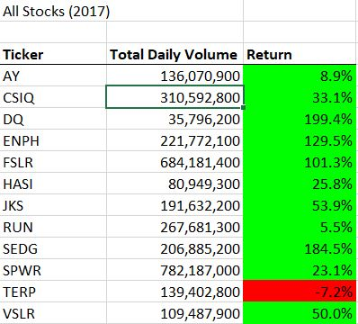

# VBA of Wallstreet

## Overview of Project 

We have been asked by our friend Steve to perform an analysis on the market trends of green companies in order to help his parents with their investments. 

To perform this analysis, we created macros in VBA that looked at the Total Daily Volume and the Rate of Return for green company stocks over the course of certain years. Initially, we looked specifically at the DQ stock, since that was what Steve's parents had invested in. However, in order to ensure we had a more complete picture of the market in green companies and to assist in diversifying Steve's parents' investments, we expanded our analysis over stocks in all green companies.

Finally, once we set up a macro that was both useful for Steve's work and could be easily understood and used by him - for example, by formatting the results and creating simple buttons that can run the analysis on a given year - we refactored our code to reduce runtime and strain on the system, ensuring more efficient results.

## Results

### Stock Performance

We found that 2017 was a good market year for green companies. Every company that was analyzed had a positive rate of return, with the exception of TERP, which lost 7.2% of value over the year. Four stocks in particular - DQ, ENPH, FSLR, and SEDG - at least doubled their value over 2017, with DQ having the largest increase in value with +199.2%. It's clear that DQ would have been a fantastic stock to invest in at the beginning of 2017. 

### Code Execution Times

## Summary
- What are the advantages or disadvantages of refactoring code?
- How do these pros and cons aply to refactoring the original VBA script?
